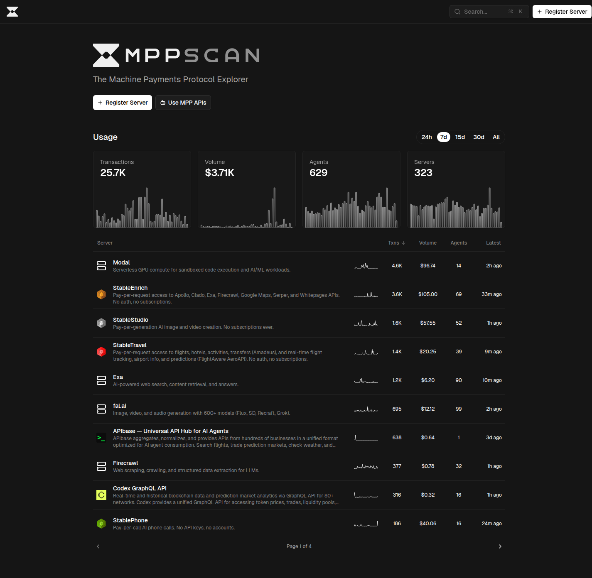

# Situation Report - 2026-03-28

## Highlights

**1. a16z: Blockchains Need Predictability, Not Just Speed** — Garimidi, Neu, and Resnick argue that throughput is solved; the frontier is now *predictability*. Single-leader protocols create two exploitable gaps: censorship (selective tx exclusion) and information asymmetry (leader sees pending txns before ordering own). A bid-sniping example demonstrates how the leader wins any auction either by excluding rivals or copying their bids after observation. The required fixes are short-term censorship resistance (any valid tx reaching an honest node must be included in the next block) and hiding (tx contents concealed until ordering is immutable via threshold/timelock encryption). This is a direct critique of single-proposer PBS designs and implies architectural changes to attester-proposer separation. [Link](https://a16zcrypto.substack.com/p/what-blockchains-need-to-compete)

**2. AetherWeave: Stake-Backed P2P Peer Discovery for Ethereum** — Prototyped on Prysm, AetherWeave couples stake-based Sybil resistance with private gossip and on-chain slash proofs: nodes prove deposit ownership via ZK membership proofs (without revealing which deposit), rate-limit discovery requests via cryptographic commitments, and produce publicly verifiable misbehavior proofs that trigger on-chain slashing. Per-node overhead is O(s√n). Security is formally proved with adversarial simulations showing the honest overlay stays connected or raises a detection flag. This is the first peer-discovery protocol deployable on live Ethereum clients (Prysm fork available) that addresses Eclipse attacks with cryptographic finality. [Link](https://arxiv.org/abs/2603.23793)

**3. EF Formally Reframes L1/L2 as Co-Equal Partners** — The EF Platform team's essay introduces a mutual-benefit framework: L2s inherit L1 security/liquidity/reputation; L1 gains ETH demand extension. L1 scales "by orders of magnitude" through ZK while remaining the permissionless DeFi hub. Concrete technical commitments: native rollups (L1-verifiable L2s eliminating security councils), blob space expansion, synchronous composability via L1SLOAD/L1STATICCALL. L2s must pass the "walkaway test" and clearly communicate which Ethereum properties they inherit vs. override. This is the most operationally specific official framing of the L1/L2 relationship to date. [Link](https://blog.ethereum.org/en/2026/03/23/l1-l2-ethereum)

**4. NI-DKG: Non-Interactive Distributed Key Generation via zk-SNARKs** — Traditional DKG requires an interactive complaint phase for detecting malformed shares. NI-DKG eliminates this: each participant posts a single EVM transaction containing Feldman polynomial commitments, ElGamal-encrypted shares, and a zk-SNARK proving consistency across all three, verified atomically on-chain. All protocol phases reduce to block-number-delimited epochs with no back-and-forth. The fully public, auditable transcript enables trustless randomness beacons and threshold signature wallets — a significant simplification for rollup sequencer committees and MPC bootstrapping. [Link](https://eprint.iacr.org/2026/552)

**5. Open Agentic Commerce: HTTP 402's 28-Year Redemption** — Ragsdale's a16z piece argues stablecoins finally make the dormant HTTP 402 payment model viable: sub-cent fixed transaction costs dissolve the economics that killed micropayments in 1997. Stack Overflow traffic is down 75% post-GPT-4; agents don't click ads. Two open protocols compete: x402 (Coinbase, HTTP 402-based) and mpp (Tempo/Stripe). Claude 4.5+ and Codex 5.2+ can discover and use unfamiliar APIs without prior training. MPPScan (25.7K txns, $3.7K USDC/7d) and x402scan (41.9K all-time txns, $14.4K) provide live grounding: the stack is real. [Link](https://a16zcrypto.substack.com/p/open-agentic-commerce-and-the-end)

---

## Blogs & Research

### MEV / PBS / Block Building

**[Blockchains Are Fast Enough for Finance. Now What?](https://a16zcrypto.substack.com/p/what-blockchains-need-to-compete)** — a16z Crypto (Garimidi, Neu, Resnick), Mar 25
Two unsolved failure modes in single-leader chains: censorship and information asymmetry. Required properties: short-term censorship resistance + transaction hiding. Current DeFi workarounds (UniswapX, CoWSwap) sacrifice composability and are fragile; the authors argue protocol-level fixes are required for capital-markets-grade blockchain infrastructure.

**[Strong Chain Quality](https://decentralizedthoughts.github.io/2026-03-23-strong-chain-quality/)** — Decentralized Thoughts (Abraham, Garimidi, Neu), Mar 23
Introduces SCQ: X% stake → X% of every block's space (not just probabilistically over time). Implemented via two additional BFT rounds where validators sign inclusion lists before voting. Zero variance vs. traditional Chain Quality's probabilistic allocation — relevant to inclusion list design in Ethereum's ePBS roadmap. Known limitations: does not address ordering within allocated space or last-look advantage.

**[Ethereal News Weekly #17](https://ethereal.news/ethereal-news-weekly-17/)** — Ethereal, Mar 27
Glamsterdam (mid-2026): ePBS devnets iterating with cached PTC windows. Hegotá (late-2026): EIP-8141 frame transactions under consideration. Arbitrum Timeboost secondary market compressing primary auction competition. Security: Privacy Pools disclosed a critical key-entropy bug (~53-bit effective entropy) requiring full key migration; Resolv Labs investigating $80M in unbacked USR stablecoin minted via compromised keys. NYSE/Securitize partnership for tokenized securities on Ethereum. Consensus: Lighthouse ~52%, Geth ~41%, Lido 23.4% stake.

### Ethereum / L2 / Rollups

**[How L1 and L2s Can Build the Strongest Possible Ethereum](https://blog.ethereum.org/en/2026/03/23/l1-l2-ethereum)** — Ethereum Foundation, Mar 23
L1 roadmap: ZK scaling by "several orders of magnitude," native rollups (no security councils), blob expansion (~30% capacity now), faster finality. L2 asks: Stage 2 status, synchronous composability, transparent security communication. New "walkaway test": users must be able to safely exit to L1 even during operator failure — a concrete accountability threshold for sequencer decentralization.

### Agentic Commerce

**[Open Agentic Commerce and the End of Ads](https://a16zcrypto.substack.com/p/open-agentic-commerce-and-the-end)** — a16z Crypto (Ragsdale), Mar 21
x402 (Coinbase) and mpp (Tempo/Stripe) as the competing open payment protocols. AgentCash provides unified merchant discovery across both ecosystems. Historical parallel: open protocols (HTTP/HTML/DNS) defeated AOL's walled garden — open agent payment rails will displace closed-platform agent commerce (ChatGPT, Gemini checkouts). Key enabler: modern LLMs can discover and use unfamiliar APIs without prior training.

### P2P Networking

**[Running Iroh on an ESP32](https://www.iroh.computer/blog/iroh-on-esp32)** — Iroh (n0), Mar 24
Iroh's P2P networking library running on an ESP32 WROVER (386DX40-class CPU, 4 MiB RAM, ~$8). Required: pure-Rust `rustls-rustcrypto` fallback (ring/AWS-LC-RS use Xtensa-incompatible assembly), AES-128-GCM + X25519 only (RSA dropped), LTO + `opt-level = "z"` to fit 88.53% of 4 MiB flash. A verified echo handshake with crates.io Iroh confirms it works. Team committed to 32-bit embedded as a first-class target. Opens a credible path to P2P connectivity at the IoT edge without intermediaries.

### Privacy & Security

**[How Not to Mandate Device-Based Age Assurance](https://educatedguesswork.org/posts/device-based-age-assurance/)** — Eric Rescorla (EKR), Mar 27
EKR systematically dismantles CA AB 1043, Illinois, Alaska HB 46, NY SB 8102A, Michigan SB 284. Key failures: DNS-over-HTTPS + ECH neutralize content filtering; OS liability clauses hit open-source projects (MidnightBSD, DB48X); Android 9.0 at 4% market share makes immediate compliance impossible; requiring all apps to query age APIs distributes sensitive data without consent; annual check-rate limits leak precise birthdays. Proposed fixes: compliance only on substantial updates, opt-in data minimization, OS-level coarse jurisdiction signals. The most technically rigorous public analysis of age-assurance legislation.

### Local-First Software

**[Ink & Switch Dispatch 015: Inkstravaganza](https://www.inkandswitch.com/newsletter/dispatch-015/)** — Ink & Switch, Mar 26
PlayBook in continuous use for 2+ years. New research directions: Portemine investigates propagator networks as a computational substrate (constraint solving, SAT, temporal visualization) — a potential principled reactive computation model for local-first software beyond CRDTs; gesture architecture uses "firm press" for tool switching without disrupting stylus flow; DrawDeck is an experimental spatial computation system with persistent state between objects. Local-First Conf 2026 Lab Day announced.

### Rust Ecosystem

**[This Week in Rust 644](https://this-week-in-rust.org/blog/2026/03/25/this-week-in-rust-644/)** — Mar 25
Canonical joined Rust Foundation as Gold member. Key new crates: `noq` (pure-Rust QUIC, RFC 9000 — Crate of the Week), `dial9` (Tokio flight recorder), `vigil-rs` (PID 1 supervisor), `indxr v0.2.0` (codebase indexer + MCP server for AI agents). Language: `#[diagnostic::on_move(message)]` attribute, `BTreeMap::append()` via CursorMut, `is_disconnected` for MPSC/MPMC. CVE-2026-33056 (Cargo advisory) disclosed. TokioConf 2026: Apr 20-22, Portland.

---

## Academic Papers

### Cryptography & ZK

**[AetherWeave: Sybil-Resistant Robust Peer Discovery with Stake](https://arxiv.org/abs/2603.23793)** — Alpturer, Doumanidis, Zohar (arXiv cs.DC, Mar 24)
ZK membership proofs for stake deposits + cryptographic commitment rate-limiting + on-chain slash proofs via misbehavior transcripts. O(s√n) per-node overhead. Prototype forked from Prysm. Formally proved: honest overlay stays connected or raises attack-detection flag. First peer-discovery protocol combining stake Sybil resistance, private gossip, and on-chain slashing in a deployable Ethereum client fork.

**[NI-DKG: Non-Interactive Distributed Key Generation Using Blockchain and ZK Proofs](https://eprint.iacr.org/2026/552)** — Kampa, Escrich, Bellés-Muñoz, Baig (ePrint 2026/552)
Single EVM transaction per participant: Feldman polynomial commitments + ElGamal-encrypted shares + Chaum-Pedersen DLEQ proofs + a single zk-SNARK over all three. Smart contract verifies atomically. Protocol reduces to block-epoch-delimited rounds with no back-and-forth. Also specifies threshold decryption and optional secret key disclosure circuits. Eliminates the interactive complaint phase from blockchain-native DKG.

**[zk-X509: Privacy-Preserving On-Chain Identity from Legacy PKI via ZK Proofs](https://arxiv.org/abs/2603.25190)** — Bak et al. (Tokamak Network, arXiv cs.CR, Mar 26)
X.509 chain verification inside a RISC-V zkVM: private key proves ownership via OS keychain delegation (macOS Secure Enclave / Windows TPM), never enters the circuit. Verifies full cert chain, ECDSA P-256 / RSA-2048, CRL revocation, binds to Ethereum address. 13 public committed values. Sybil-resistant nullifier. On-chain Groth16: ~300K gas. Proof gen: 11.8M cycles (P-256), 17.4M (RSA-2048). Eight security properties formalized under Dolev-Yao with reductions to sEUF-CMA.

**[A Universal Blinder: One-Round Blind Signatures from FHE](https://eprint.iacr.org/2026/574)** — Dan Boneh, Jaehyung Kim (ePrint 2026/574, Mar 23)
Three compiler variants transforming any secure signature scheme into a one-round blind signature scheme using FHE. Signer homomorphically evaluates the signing algorithm over FHE-encrypted message — never sees plaintext. Output signatures are format-identical and backward-compatible with the base scheme. Introduces "committed verifiable FHE" as an independent primitive. Direct application to anonymous credentials and e-cash without requiring changes to existing signature verifiers (e.g., Ethereum ECDSA).

**[Human-Extractable ZK Proofs of Knowledge: A Solution to Dark DAOs](https://eprint.iacr.org/2026/511)** — Yin, Tian, Zhang, Ren (ePrint 2026/511)
Dark DAOs exploit MPC/TEE key encumbrance to make votes programmably sellable. HE-ZKPoK interleaves standard ZKPoK with human-extractable CAPTCHA challenges: any watching human can extract the witness from the CAPTCHA transcript. If a voter delegates CAPTCHA-solving to a Dark DAO, their key is exposed — key-encumbrance-based vote selling becomes self-defeating. No TEE, no trusted hardware, no new on-chain infrastructure required. First software-only Dark DAO countermeasure.

**[Post-Quantum Blockchains with Agility in Mind](https://eprint.iacr.org/2026/609)** — Santos, Ferrin, Kahat, Lodder (Tectonic Labs, ePrint 2026/609, Mar 27)
Two constructions: (1) Cryptographically Agile Transactions (CATX) — decouples tx body from signature, each user selects their own scheme (ECDSA, Falcon-512, ML-DSA) at tx time, zero measurable overhead over 30K blocks / 11M txns; (2) consensus-layer key registration allowing validators to rotate signature schemes without a hard fork. First EVM-compatible design embedding cryptographic agility as a first-class primitive from genesis.

### Distributed Systems & Consensus

**[SNARE: A TRAP for Rational Players to Solve Byzantine Consensus in the 5f+1 Model](https://arxiv.org/abs/2603.23458)** — Ranchal-Pedrosa, Marsh (arXiv cs.GT/cs.DC, Mar 2026)
Extends TRAP rational BFT to n=5f+1. Single all-to-all broadcast round + 4f+1 threshold after predecision. Coalition-resistance up to 3f nodes (~60% of n) without deposits. Valid-candidacy property eliminates front-running unconditionally, relaxing prior constraints and pushing tolerance from C<n/2 to C<5n/9. Above 60%: baiting-with-deposits. Finalization via one-shot BFTCR concurrent with next view (+1 message delay). First rational BFT tolerating majority-sized coalitions with only 5f+1 nodes and no commit-reveal overhead.

**[Supermassive Blockchain](https://arxiv.org/abs/2603.23927)** — Sun, Li (arXiv cs.DC, Mar 25)
State-execution decoupled architecture: state encoded with systematic erasure codes and distributed as fragments across nodes; any node reconstructs full state from a subset. BFT consensus operates over coded data, preserving safety/liveness with <1/3 Byzantine nodes. Directly addresses Ethereum's state growth problem where full-node storage now requires multiple terabytes — erasure coding enables unbounded state without proportional per-node hardware scaling.

---

## Dashboard Activity

### MPPScan (Machine Payments Protocol) — 7-day rolling

| Metric | Value |
|---|---|
| Total Transactions | 25,686 |
| Total Volume | $3,712 USDC |
| Unique Agents | 629 |
| Unique Servers | 323 |
| Registered Servers | 37 |

**Top services by transaction count:**

| Service | Txns | Volume | Agents |
|---|---|---|---|
| Modal (GPU compute) | 4,601 | $96.74 | 14 |
| StableEnrich (data APIs) | 3,576 | $105.00 | 69 |
| StableStudio (AI image/video) | 1,610 | $57.55 | 52 |
| StableTravel (flights/hotels) | 1,364 | $20.25 | 39 |
| Exa (AI web search) | 1,228 | $6.20 | 90 |
| fal.ai (image/video/audio) | 695 | $12.12 | 99 |

Notable: fal.ai leads unique agent count (99), Exa second (90) — widespread micro-payment adoption for AI search/generation. StableEnrich leads volume despite #2 rank in txns. Protocol runs on Tempo blockchain.

---

### x402scan (x402 Ecosystem) — All-time / 7-day seller rankings

| Metric | Value |
|---|---|
| Total Transactions (all-time) | 41,895 |
| Total Volume (all-time) | $14,403 USDC |
| Unique Buyers | 1,181 |
| Unique Sellers | 433 |

**Top sellers by 7-day transaction count:**

| Service | Txns | Volume | Buyers | Chain |
|---|---|---|---|---|
| ACP - Virtuals Protocol | 12,240 | $2,563 | 412 | Base |
| SniperX (Solana alpha) | 5,272 | $105 | 13 | Solana |
| hugen.tokyo (DeFi/travel) | 4,234 | $148 | 6 | Base |
| StableEnrich | 3,875 | $99 | 43 | Base+Solana |
| BlockRun (AI data/models) | 2,771 | $185 | 67 | Base |
| Dexter x402 Facilitator | 2,138 | $113 | 177 | Solana |
| Clash Agentic Commerce | 156 | $1,242 | 145 | Base |
| AnySpend x402 | 132 | $218 | 73 | Base |

Notable: ACP - Virtuals Protocol dominates at 2.4x the next seller. Clash Agentic Commerce shows unusually high volume/txn (~$8 avg). StableEnrich appears in both MPP and x402 ecosystems — the most cross-protocol service. Base (Coinbase) and Solana are both active chains; Dexter is the primary Solana facilitator.

---

## Industry News

### Hacker News
- **[I put all 8,642 Spanish laws in Git — every reform is a commit](https://github.com/EnriqueLop/legalize-es)** (458 pts) — Append-only, version-controlled legal corpus; touches verifiable public records and local-first data patterns
- **[Matadisco – Decentralized Data Discovery](https://matadisco.org/)** (38 pts) — Decentralized data discovery layer; distributed systems / P2P data indexing

### Lobsters
- **[The Comforting Lie of SHA Pinning](https://www.vaines.org/posts/2026-03-24-the-comforting-lie-of-sha-pinning/)** (37 pts) — Cryptographic hash pinning security analysis; supply chain integrity
- **[IronFleet: Proving Practical Distributed Systems Correct](https://www.youtube.com/watch?v=KRmItldCU-Y)** — Formal verification of distributed protocols (video)
- **[Capability-based Security for Redox: Namespace and CWD as Capabilities](https://www.redox-os.org/news/nlnet-cap-nsmgr-cwd/)** (11 pts) — Capability-based security model in Rust OS; privacy-preserving system design

---

## New Releases

- **Fyrox 1.0** — Rust game engine reaches stable release
- **Zellij 0.44** — Terminal multiplexer adds native Windows support and remote sessions
- **[noq](https://crates.io/crates/noq)** — Pure-Rust QUIC implementation (RFC 9000); Crate of the Week
- **[indxr v0.2.0](https://crates.io/crates/indxr)** — Codebase indexer with built-in MCP server for AI agent tooling
- **[dial9](https://crates.io/crates/dial9)** — Tokio flight recorder for async runtime observability
