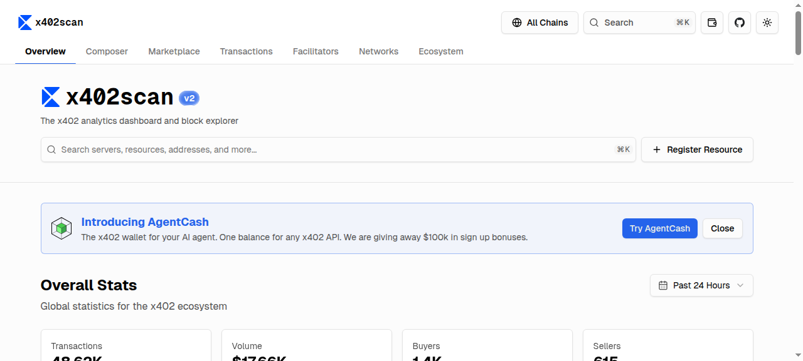

# Situation Report - 2026-04-01

## Highlights

**1. Google/Boneh/Drake: Quantum Breaks Blockchain ECDSA with <500K Physical Qubits** — Babbush, Zalcman, Gidney et al. (including Dan Boneh and Ethereum Foundation's Justin Drake) present optimized Shor's algorithm circuits: <1,200 logical qubits / <90M Toffoli gates, executing in minutes on a superconducting architecture with <500,000 physical qubits — a ~20x reduction over prior estimates. 6.7M BTC (~$200B+) sit in addresses with exposed public keys and are immediate targets. The paper was validated via a zero-knowledge proof for responsible disclosure and points toward a coordinated 2029 PQ migration timeline across Ethereum, Bitcoin, and Coinbase. This is the most concrete quantum threat assessment published to date, turning the timeline from theoretical to engineering-roadmap territory. [Link](https://arxiv.org/abs/2603.28846)

**2. Merkle Tree Certificates: Post-Quantum Forces a PKI Redesign** — Google and Cloudflare are co-developing Merkle Tree Certificates (MTCs) through the IETF PLANTS working group. Post-quantum signatures (ML-DSA-44: 1,312-byte keys, 2,420-byte sigs) would cause 10x TLS handshake bloat. MTCs replace embedded CA signatures with compact Merkle inclusion proofs, fundamentally restructuring Certificate Transparency. Bootstrap target: 2027. Google has accelerated its PQ migration deadline to 2029, citing 20x improvement in elliptic curve attacks. This is the most significant structural change to Web PKI since CT became mandatory in 2018. [Link](https://www.feistyduck.com/newsletter/issue_135_web_pki_reimagined_with_merkle_tree_certificates)

**3. AHAB: Production-Grade Async Threshold Schnorr at 100K-250K Sigs/Sec** — Victor Shoup presents asynchronous threshold Schnorr protocols with guaranteed output delivery for t < n/3 corruptions. Key innovation: a player-elimination pipeline where disrupted presignature batches cost at most O(t\*) overhead and permanently remove all corrupt signers. The t < n/4 variant achieves worst-case linear communication by eliminating complaints entirely. Full adaptive security in the erasure model. Directly relevant to Taproot multisig, bridge protocols, and MPC custody. [Link](https://eprint.iacr.org/2026/620)

**4. zkMesh March 2026: ZK Ecosystem Hits Production Phase** — The monthly recap shows the ZK field entering a critical maturity transition. Highlights: WHIR proving integrated into Plonky3, Aztec Alpha Network launched, Linea transitioning to RISC-V, and critical vulnerabilities disclosed in both Zcash Zebra and Aztec Alpha v4. Post-quantum urgency dominates: lattice HD wallets, Falcon signature aggregation for PQ mempools, and zkSecurity's KZG vs IPA vs FRI comparison. The simultaneous deployment and vulnerability-disclosure cycle signals healthy but high-stakes production adoption. [Link](https://zkmesh.substack.com/p/zkmesh-march-2026-recap)

**5. CAGP: On-Chain Quantum Canary for Bitcoin** — Keshavarzkalhori et al. propose trustless quantum canary addresses — publicly auditable cryptographic bounties whose redemption proves a CRQC capable of solving ECDLP exists. Decentralized generation (no trusted dealer), adjustable difficulty, Bitcoin Script compatible. Complementary to the Google/Boneh paper: rather than estimating when quantum breaks crypto, CAGP empirically detects it. Adoptable by exchanges, DAOs, or governance as an emergency PQ migration trigger. [Link](https://eprint.iacr.org/2026/618)

---

## Blogs & Research

### ZK / Cryptography

**[zkMesh: March 2026 Recap](https://zkmesh.substack.com/p/zkmesh-march-2026-recap)** — zkMesh, Mar 31
Dense monthly roundup. Notable research: Icefish (zk-SNARKs for verifiable genomics), zkVM SoK paper, VEIL (lightweight ZK for hash-based multilinear proof systems). Production milestones: WHIR in Plonky3, Aztec Alpha launch, Linea moving to RISC-V. Security: critical vulns in Zcash Zebra and Aztec Alpha v4. PQ theme dominates: lattice HD wallets, Falcon aggregation, post-quantum wallet derivation. zkSummit14 preview.

**[Web PKI Reimagined with Merkle Tree Certificates](https://www.feistyduck.com/newsletter/issue_135_web_pki_reimagined_with_merkle_tree_certificates)** — Feisty Duck #135, Mar 31
Google/Cloudflare co-developing MTCs via IETF PLANTS working group. PQ signatures cause 10x TLS handshake bloat; MTCs solve this by replacing embedded CA + CT-log signatures with compact Merkle inclusion proofs. Redesigned CT drops precertificates and public key duplication. Transition requires simultaneous X.509 + standalone MTC + landmark MTC serving. Google's 2029 PQ deadline is concrete — bootstrap by 2027.

### Rust Ecosystem

**[Fixing Our Own Problems in the Rust Compiler](https://tweedegolf.nl/en/blog/234/fixing-our-own-problems-in-the-rust-compiler)** — Tweedegolf, Mar 31
Tweede golf's data-compression rewrites (zlib-rs, libbzip2-rs, libzstd-rs-sys) stress-test the compiler in ways application code does not. Upstream contributions: Clippy fix for parenthesized `if` expressions (#15304), new `ptr_offset_by_literal` lint (#15606), Miri AVX-512 intrinsic extensions, `cfg_select` landing in Rust 1.95 stable, and progress on `c_variadic` stabilization (a decade-old feature gate) — the prerequisite for Rust to fully replace C compression libraries.

### Security

**[Fuzzing to Zero-Day: Pwning V8CTF with TurboFan Type Confusion](https://www.zellic.io/blog/pwning-v8ctf)** — Zellic, Mar 30
CVE-2025-2135: type confusion in V8's TurboFan JIT via `InferMapsUnsafe()`. `IsSame(receiver, object)` fails to detect aliasing when distinct IR nodes reference the same heap object at runtime. Passing one array as both parameters triggers elements-kind transition on one alias while the compiler retains a stale map for the other — yielding `fakeObj`/`addrOf` primitives escalated to arbitrary read/write. Same alias-blindness pattern as CVE-2020-6418 and CVE-2021-30632. V8 type-confusion exploitation is now "formulaic," suggesting sea-of-nodes IR carries an inherent security tax.

---

## Academic Papers

### Post-Quantum Cryptography

**[Securing Elliptic Curve Cryptocurrencies against Quantum Vulnerabilities](https://arxiv.org/abs/2603.28846)** — Babbush, Zalcman, Gidney, ..., Boneh, Drake (Google, EF, Coinbase)
Optimized Shor circuits: <1,200 logical qubits / <90M Toffoli gates or <1,450 / <70M. Executes in minutes with <500K physical qubits at 10^-3 error rate — 20x reduction over prior estimates. 6.7M BTC with exposed pubkeys are immediate targets. Validated via ZK proof for responsible disclosure. Proposes "digital salvage" policy for irrecoverable funds and a 2029 coordinated PQ migration.

**[CAGP: A Quantum Canary Address Generation Protocol](https://eprint.iacr.org/2026/618)** — Keshavarzkalhori, Sala-Mimó, Herrera-Joancomartí, Pérez-Solà
Trustless distributed protocol for Bitcoin quantum canary addresses — cryptographic bounties whose redemption proves CRQC existence. Adjustable ECDLP difficulty, Bitcoin Script compatible. PoC implementation provided.

**[Breaking SHA-3 via Fault Injection: Key Recovery on PQ Signatures](https://eprint.iacr.org/2026/619)** — Sobhani, Jendral, Dubrova, Näslund
Single instruction-skip fault on Keccak-f during sponge squeezing inverts SHA-3's one-way property, recovering hash inputs. Validated on ARM Cortex-M4 pqm4 implementation of CROSS (NIST candidate). Extends to LESS, MAYO, Mirath, RYDE, PERK. Critical for hardware wallets and IoT running PQ schemes — post-quantum security on paper is meaningless if a voltage glitch recovers signing keys.

**[PQ Signature Memory and Bandwidth Scaling](https://eprint.iacr.org/2026/617)** — Strenzke
Systematic analysis of how ML-DSA, SLH-DSA scale in memory/bandwidth with message size. PQ schemes exhibit substantially worse scaling than RSA/ECDSA for realistic use cases. Evaluates streaming (online) computation support. Previews PKCS#11 v3.2 API — first version integrating PQC. Directly relevant to blockchain tx signing where calldata costs scale with signature size.

### Threshold Cryptography

**[AHAB: Asynchronous Threshold Schnorr Signatures](https://eprint.iacr.org/2026/620)** — Shoup
Suite of async threshold Schnorr protocols with guaranteed output delivery (t < n/3). Player-elimination pipeline: disrupted batches cost O(t\*) and permanently remove corrupt signers. t < n/4 variant achieves worst-case linear communication. Full adaptive security in erasure model. 100K-250K sigs/sec throughput.

### Distributed Systems & Consensus

**[Legible Consensus: Topology-Aware Quorum Geometry](https://arxiv.org/abs/2603.28788)** — Mason
"Crumbling-wall" quorum construction separating inter-tier obligation from intra-tier replication across physically tiered networks (Earth/LEO/Moon/Mars). Verified in TLA+. During Mars conjunction blackout, 3 of 4 tiers retain global consensus. Measured latencies: 183ms (Earth), 131ms (LEO), 5.1s (Moon). Makes failure modes structurally transparent vs. flat symmetric quorums.

**[Lightweight Hybrid Pub/Sub Event Fabric](https://arxiv.org/abs/2603.30030)** — Gkoulis
CNS: unifies in-process pub/sub with NATS-backed distributed pub/sub via bridge runtime. Typed event keys, per-family serialization. Local delivery ~30μs, distributed 1.26-1.37ms, hybrid bridged 1.64-1.89ms. Targets modular services needing cheap intra-process coordination + selective cross-node distribution.

### TEE & Hardware Security

**[HPCCFA: Hardware Performance Counters for TEE Control Flow Attestation](https://arxiv.org/abs/2603.29749)** — Pott, Wilke, Wichelmann, Eisenbarth
Extends TEE static attestation with runtime CFA using HPCs on commodity CPUs. PoC on Keystone (RISC-V). Detects runtime control-flow violations inside enclaves that static attestation misses. Deployable on commodity hardware without specialized tracing silicon.

**[Detecting Speculative Leaks with Compositional Semantics](https://arxiv.org/abs/2603.29800)** — Fabian, Guarnieri, Köpf et al.
Defines speculative non-interference (SNI) — a compositional security notion for reasoning about speculative execution leaks. Spectector tool uses SMT solvers to automatically detect Spectre vulnerabilities. Compositionality means new speculation mechanisms can be analyzed incrementally — relevant to any system where node-level Spectre attacks threaten confidentiality (shared cloud, TEE-adjacent code).

---

## Dashboard Activity

### MPPScan (Machine Payments Protocol) — All-Time

| Metric | Value |
|---|---|
| Total Transactions | 32,460 |
| Total Volume | $3,720 USDC |
| Unique Agents | 599 |
| Unique Servers | 397 |

**Top services:**

| Service | Txns | Volume | Buyers |
|---|---|---|---|
| Apollo via Locus MPP | 6,463 | $58.09 | 9 |
| StableEnrich | 5,113 | $115.50 | 70 |
| StableStudio | 3,430 | $96.53 | 95 |
| Mobula API | 2,407 | $1.00 | 2 |
| Suno via Locus MPP | 1,780 | $29.44 | 16 |
| Perplexity via Locus MPP | 991 | $30.46 | 31 |
| Grok via Locus MPP | 933 | $60.88 | 28 |
| fal.ai | 721 | $12.34 | 87 |
| Exa | 474 | $2.41 | 70 |

Notable: **Locus MPP** has emerged as a dominant aggregator, routing traffic to Apollo, Suno, Perplexity, and Grok — aggregation layer forming in the MPP ecosystem. Peak activity Mar 28-29 with spikes >5,900 txns. fal.ai and Exa have broadest buyer diversity (87/70 unique agents).

---

### x402scan (x402 Ecosystem) — All-Time / 24h Rankings

| Metric | Value |
|---|---|
| Total Transactions | 48,620 |
| Total Volume | $17,660 USDC |
| Unique Buyers | 1,400 |
| Unique Sellers | 615 |

**Top sellers (24h):**

| Service | Txns | Volume | Buyers | Chain |
|---|---|---|---|---|
| ACP - Virtuals Protocol | 10,750 | $396.77 | 443 | Base |
| Vishwa Network MCP | 9,800 | $9.80 | 296 | Base |
| SniperX | 5,230 | $104.49 | 13 | Solana |
| BlockRun | 2,450 | $153.00 | 78 | Base |
| StableEnrich | 2,250 | $59.34 | 44 | Base |
| Dexter x402 Facilitator | 1,350 | $73.32 | 184 | Solana |

**Top facilitators (24h):** Coinbase (16.3K requests, $1.47K), Dexter (11K, $443), PayAI (10.4K, $178).

**Top agents:** x402Arvos (35.4K chats, 5K users), Canza (15.7K chats), x402-secure Agent (4.5K chats).

Notable: **x402 is now 1.5x larger than MPP** (48.6K vs 32.5K total txns, $17.7K vs $3.7K volume). Vishwa Network MCP is a new high-volume entrant at 9,800 txns. Coinbase handles ~1/3 of all facilitation. StableEnrich continues as the only cross-protocol service active in both ecosystems.

---

## Industry News

### Hacker News
- **[Is BGP Safe Yet? No.](https://isbgpsafeyet.com/)** (117 pts) — BGP RPKI adoption tracker; relevant to P2P and distributed infrastructure security
- **[MiniStack — LocalStack replacement](https://ministack.org/)** (207 pts) — Local cloud service emulator for distributed system dev/test
- **[Linux IPv6-Only Patches Deprecating "Legacy" IPv4](https://www.phoronix.com/news/Linux-IPv6-IPv4-Legacy-Knobs)** (129 pts) — Kernel-level IPv6 changes affecting networking infrastructure

### Lobsters
- **[Supply Chain Attack on Axios](https://socket.dev/blog/axios-npm-package-compromised)** (57 pts) — Major npm package compromised; software supply chain integrity
- **[Why Have Supply Chain Attacks Become Near-Daily?](https://lobste.rs/s/nz2wdr)** (53 pts) — Discussion on trust models and cryptographic verification
- **[DSTs Are Just Polymorphically Compiled Generics](https://faultlore.com/blah/dsts-are-polymorphic-generics/)** (17 pts) — Deep dive into Rust's dynamically-sized type internals
- **[Linear Types Proposal for Hare](https://yerinalexey.srht.site/borrow/notes.html)** (15 pts) — Linear/affine type system design comparable to Rust's ownership model

---

## New Releases

No major releases in the 24h window.

---

## Cross-Cutting Themes

**Post-quantum is no longer "eventually" — it's an engineering sprint.** Five independent signals converge: Google/Boneh/Drake reduce the ECDSA break estimate to <500K physical qubits (20x improvement); Feisty Duck reports MTCs targeting 2027 bootstrap for PQ-safe PKI; CAGP proposes on-chain quantum canary detection; SHA-3 fault injection breaks PQ signature implementations on embedded hardware; and PQ signature scaling analysis reveals the memory/bandwidth costs that make drop-in replacement infeasible. The zkMesh March recap adds that the ZK community is treating PQ as an architectural — not just algorithmic — problem. The coordinated authorship of the Google paper (with Justin Drake and Dan Boneh) signals institutional alignment toward a 2029 migration deadline.

**Agentic commerce divergence: x402 pulls ahead on volume while MPP develops aggregation.** x402scan now shows 48.6K transactions and $17.7K volume vs MPP's 32.5K / $3.7K. But the ecosystems are structurally different: x402 has single dominant sellers (Virtuals Protocol at 10.75K txns), while MPP's Locus aggregator routes traffic to AI services (Apollo, Suno, Perplexity, Grok). StableEnrich operates across both protocols. The facilitator layer is consolidating — Coinbase handles 1/3 of x402 facilitation.

**JIT compilers as a structural security problem.** Zellic's V8CTF writeup demonstrates that alias-unaware map inference in sea-of-nodes IR keeps producing exploitable type confusions (CVE-2025-2135 follows the same pattern as CVE-2020-6418 and CVE-2021-30632). In parallel, the Spectre compositionality paper and TEE CFA work address the deeper hardware-level leakage that JIT compilation amplifies. The V8 pattern suggests that incremental patches cannot fully address the security tax of speculative, optimizing runtimes.
