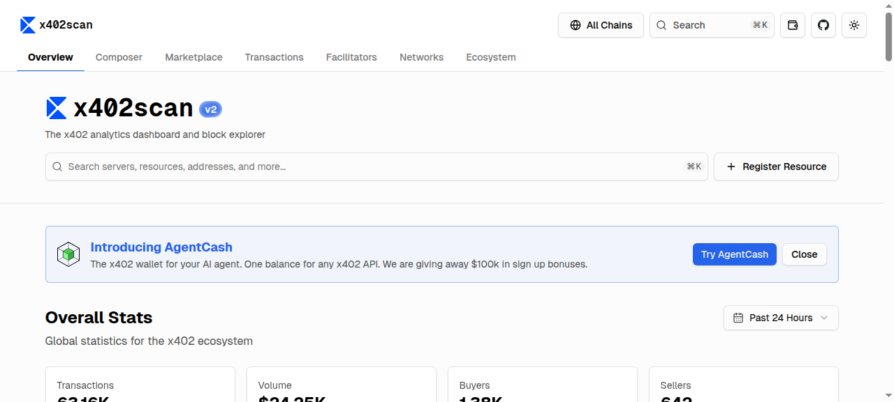

# Situation Report - 2026-04-02

## Highlights

**1. Vitalik: Self-Sovereign Local LLMs Are Now Practical** — Vitalik published a detailed guide to running frontier-quality LLMs on personal hardware without cloud dependencies. His stack: NVIDIA 5090 laptop GPU (24 GB, 90 tok/s with Qwen3.5:35B), AMD Ryzen AI Max Pro (128 GB unified memory, 51 tok/s), NixOS + llama-server + ComfyUI. He enumerates five threat categories (LLM privacy leakage, non-LLM data leakage, remote jailbreaks, accidental misuse, backdoors) and prescribes aggressive sandboxing. The post directly challenges the assumption that frontier AI requires cloud access, framing local-first AI as a privacy imperative at the moment E2E encryption was gaining ground. [Link](https://vitalik.eth.limo/general/2026/04/02/secure_llms.html)

**2. Scott Aaronson: ~25K Physical Qubits May Suffice to Break ECC** — Aaronson discusses two quantum bombshells: (1) a Caltech team demonstrated fault-tolerance with dramatically reduced overhead using high-rate codes; (2) Google's paper (yesterday's highlight) lowers the 256-bit ECDLP attack to ~25K physical qubits with new overhead estimates — down from millions. Google published via a ZK proof rather than full disclosure, a first for mathematical results. Aaronson invokes the Frisch-Peierls nuclear precedent. Cryptographers push back, arguing openness better motivates PQ migration. This amplifies yesterday's Google/Boneh/Drake paper and compresses the threat timeline by roughly one year. [Link](https://scottaaronson.blog/?p=9665)

**3. 10x Sum-Check Prover Speedup in Jolt zkVM** — Dao, DeStefano, Bagad, Domb, and Thaler present three algorithmic improvements: reduced field multiplications for multilinear polynomial products, a small-value prover exploiting 32/64-bit witnesses, and near-elimination of equality-polynomial cost via tensor decomposition. Implemented in Jolt: >10x speedup and memory reduction on Spartan, 1.7-2.2x on Shout. Sum-check is the prover bottleneck in virtually every modern SNARK/zkVM — this directly translates to cheaper, faster proving for zkRollups. [Link](https://eprint.iacr.org/2026/587)

**4. Ethereum PoS Validators Will Rationally Collapse into One Pool** — Homoliak et al. use evolutionary game theory (replicator dynamics) to model three validator strategies: honest (~20% of rewards on hardware), lazy (skip validation, ~4% cost), and join-pool. Simulation shows "join pool + lazy" forms an evolutionarily stable equilibrium that collapses all validators into a single pool — without any adversarial behavior, pure rational economics. This quantifies a concrete centralizing force and strengthens the case for in-protocol verification enforcement. [Link](https://eprint.iacr.org/2026/578)

**5. Gryphes: Modular Hybrid SNARKs for zkRollups** — Xin et al. (HKUST/OKG) introduce a hybrid proof framework splitting zkRollup workloads: flexible lookup-based logic for transaction types + specialized Groth16 circuits for crypto operations, linked via a novel composition protocol yielding constant-size proofs. Avoids the monolithic zkVM overhead penalty while remaining fully expressive across thousands of transaction types. Open-sourced with benchmarks. [Link](https://eprint.iacr.org/2026/596)

---

## Blogs & Research

### Privacy / Local-First

**[My Self-Sovereign / Local / Private / Secure LLM Setup](https://vitalik.eth.limo/general/2026/04/02/secure_llms.html)** — Vitalik Buterin, Apr 2
Benchmarks three hardware configs for local inference. NVIDIA 5090: 90 tok/s on Qwen3.5:35B. AMD Ryzen AI Max Pro: 51 tok/s with 128 GB unified memory (can run larger models). DGX Spark: impractical. Software: NixOS + llama-server via llama-swap + ComfyUI for image/video. Five threat categories systematized. Core prescription: all inference local, aggressive sandboxing, zero cloud dependencies. Most detailed public guide from a high-profile technologist for private AI.

### Cryptography / Post-Quantum

**[Quantum Computing Bombshells That Are Not April Fools](https://scottaaronson.blog/?p=9665)** — Scott Aaronson, Apr 1
Amplifies yesterday's Google/Boneh/Drake paper. Caltech team: fault-tolerance with dramatically reduced overhead via high-rate codes for neutral-atom/trapped-ion. Google: ~25K physical qubits may suffice for 256-bit ECC (down from millions). Google's ZK publication method for mathematical results is unprecedented — Aaronson draws parallels to Frisch-Peierls. Cryptographers argue full disclosure better motivates PQ migration. Compresses quantum threat timeline by ~1 year.

**[Signing Data Structures the Wrong Way](https://blog.foks.pub/posts/domain-separation-in-idl/)** — FOKS Blog, Apr 2
Demonstrates how identically-serialized but semantically distinct types enable signature-substitution attacks — a vulnerability class that has hit Bitcoin, Ethereum DEXs, TLS, JWTs, and AWS. Solution: Snowpack IDL embeds random 64-bit domain separators in struct definitions at the type-system level. Only types implementing `VerifiableObjecter` can be signed. Separators prepended before signing, omitted from wire encoding. Transforms domain separation from a discipline problem into a compile-time guarantee.

### Rust Ecosystem

**[This Week in Rust 645](https://this-week-in-rust.org/blog/2026/04/01/this-week-in-rust-645/)** — Apr 1
Rust 1.94.1 released. RFCs approved: 3855 (mitigation enforcement) and 3721 (homogeneous try blocks). Compiler: new sanitizer targets for `x86_64` (msan, tsan) and kernel hardware-address sanitization. Library: `RangeFrom` iterator, `Path::trim_prefix`. Crate of the Week: tsastat (high-resolution thread-state analysis). 487 PRs merged; query-system optimization yielded -0.8% compile-time. Kernel-level sanitizer support signals Rust's continued push into security-critical and kernel-space domains.

---

## Academic Papers

### Zero-Knowledge Proofs / SNARKs

**[Gryphes: Hybrid Proofs for Modular SNARKs with Applications to zkRollups](https://eprint.iacr.org/2026/596)** — Xin, Cheung On Tin, Pappas, Huang, Papadopoulos (HKUST/OKG)
Matrix-lookup generalization composed with Plonk for flexible logic + Groth16 for crypto-heavy operations (hashes, signatures, RSA accumulators). Novel linking protocol for seamless composition with constant-size proofs. Supports thousands of transaction types dynamically. Open-sourced. Most concrete proposal for production zkRollups avoiding monolithic zkVM overhead.

**[Speeding Up Sum-Check Proving](https://eprint.iacr.org/2026/587)** — Dao, DeStefano, Bagad, Domb, Thaler (CMU, NYU, Ingonyama, Georgetown/a16z)
Three complementary optimizations: (1) reduced field multiplications for multilinear polynomial products; (2) small-value prover exploiting 32/64-bit witnesses as streaming prover; (3) equality-polynomial cost near-elimination via tensor decomposition. Jolt implementation: >10x speedup + memory reduction on Spartan, 1.7-2.2x on Shout. The single most impactful optimization target in the current zkVM stack.

**[Bulletproofs\*: Verifier-Efficient Arithmetic Circuit Proofs via Folding](https://eprint.iacr.org/2026/586)** — Scala, Bartoli
Applies ProtoStar folding to original Bulletproofs. The resulting IVC achieves asymptotic linear gain over repeated monolithic verification. No trusted setup, no preprocessing, no pairings. First folding scheme for the most widely deployed transparent proof system — attractive for resource-constrained environments and privacy-focused L1/L2 chains (Monero, range proofs).

**[Constraint-Friendly Map-to-Curve Relations](https://eprint.iacr.org/2026/590)** — El Housni, Bünz
Security analysis of efficient hash-to-curve constructions optimized for SNARK/STARK constraint systems. Co-authored by Bünz (Bulletproofs creator).

**[vkproof: Succinct Verification of Indexed Verifying Keys](https://eprint.iacr.org/2026/581)** — Mejias Gil, Zhao
Preprocessing SNARG for efficient SNARK verifying key verification via polynomial fingerprinting. Enables succinct verification in modular proof systems.

### Ethereum / Staking

**[Verifier's Dilemma and Staking Pools in Ethereum PoS](https://eprint.iacr.org/2026/578)** — Homoliak, Hruby, Peresini, Kostal, Smuseva
Evolutionary game theory model: honest validation costs ~20% of rewards, lazy costs ~4%. "Join pool + lazy" is the evolutionarily stable equilibrium — all validators collapse into a single pool under pure rational economics. No adversarial behavior required. Directly relevant to PBS and inclusion list design: the paper quantifies why in-protocol verification enforcement is necessary before centralization becomes irreversible.

### MPC / FHE / Privacy

**[Beyond Latency: MPC vs FHE for PPML](https://arxiv.org/abs/2604.00169)** — Huang, Maeng, Suh (ISPASS 2026)
First holistic benchmark comparing two MPC variants and FHE for ML inference across energy, cost, and latency (not just speed). Evaluates CNNs and Transformers under LAN/WAN with offline/online phase separation. Provides practitioners the data they actually need to choose a paradigm for production deployment.

**[FROSTLASS: Thresholdized Linkable Ring Signatures](https://eprint.iacr.org/2026/589)** — Babb, Goodell, Salazar, Slaughter, Szramowski
Thresholdizes CLSAG (Monero's RingCT) by extending FROST to ring signatures with linkability. t-of-n quorum produces valid linkable ring signatures; safe abort with up to t-1 malicious signers. Proven under OMDL. Rust implementation available. Bridges threshold signing and ring-signature anonymity for production Monero multisig.

**[MPC-in-the-Head Signatures with Correlated GGM Trees](https://eprint.iacr.org/2026/615)** — Feneuil, Rivain
First formal security analysis of the correlated-tree optimization in MPCitH signatures. Identifies a subtle flaw ruling out direct reduction, then proves security under mildly degraded assumptions. Validates MQOM v2 — the NIST PQC candidate with shortest MPCitH signature size. Resolves a prerequisite for confident standardization.

**[Oblivious SpaceSaving: Heavy-Hitter Detection over FHE](https://eprint.iacr.org/2026/603)** — Sohaib, Agrawal, El Abbadi (UCSB)
Reformulates SpaceSaving streaming algorithm for TFHE. "Moving Floor" optimization replaces O(k) magnitude comparisons with equality tests. Demonstrates practical encrypted stream analytics — applicable to privacy-preserving network monitoring and telemetry on untrusted servers.

**[Deniable FHE: Tighter Analysis and TFHE Construction](https://eprint.iacr.org/2026/597)** — Toyooka, Watanabe, Iwamoto
More efficient deniable FHE based on TFHE with tighter security bounds. Advances practical FHE with plausible deniability.

**[Three-Move Blind Signatures in Pairing-Free Groups](https://eprint.iacr.org/2026/593)** — Chen
First blind signature with concurrent security in pairing-free groups using only three moves. Relevant to privacy-preserving authentication without pairing assumptions.

### Cryptanalysis

**[ML Attacks on LWE with Data Repetition](https://eprint.iacr.org/2026/612)** — Alfarano, Saxena, Wenger, Charton, Lauter
ML-based attacks extended to ternary/Gaussian LWE secrets at higher dimensions via data augmentation and stepwise regression. Advances understanding of lattice-based security margins.

**[Attacks on Sparse LWE/LPN](https://eprint.iacr.org/2026/614)** — Agrawal, Bagchi, Kumar
Extended Kikuchi method for decisional k-sparse LWE/LPN at higher moduli. Improves cryptanalytic understanding of sparse lattice assumptions.

---

## Dashboard Activity

### MPPScan (Machine Payments Protocol) — 7-Day Rolling

| Metric | Value |
|---|---|
| Total Transactions | 32,380 |
| Total Volume | $3,614 USDC |
| Unique Agents | 623 |
| Unique Servers | 408 |

**Top services:**

| Service | Txns | Volume | Buyers |
|---|---|---|---|
| Apollo via Locus MPP | 6,203 | $45.17 | 11 |
| StableEnrich | 5,360 | $125.30 | 75 |
| StableStudio | 3,387 | $90.61 | 88 |
| Mobula API | 2,607 | $1.08 | 2 |
| Suno via Locus MPP | 1,874 | $30.61 | 16 |
| Grok via Locus MPP | 935 | $62.09 | 26 |
| fal.ai | 706 | $11.71 | 74 |
| Exa | 697 | $3.51 | 105 |

Notable: **Locus MPP** now appears in 4 of the top 10, confirming its position as the dominant aggregator gateway — routing AI service micropayments to Apollo, Suno, Grok, and Perplexity. Exa leads unique agent count (105), suggesting broad adoption for AI search micropayments.

---

### x402scan (x402 Ecosystem) — 24h / All-Time

| Metric | Value |
|---|---|
| Total Transactions (24h) | 63,160 |
| Total Volume (24h) | $24,250 USDC |
| Unique Buyers | 1,380 |
| Unique Sellers | 642 |

**Top sellers (24h):**

| Service | Txns | Volume | Buyers | Chain |
|---|---|---|---|---|
| ACP - Virtuals Protocol | 9,920 | $368.20 | 459 | Base |
| Vishwa Network MCP | 8,650 | $8.65 | 296 | Base |
| SniperX | 5,220 | $104.42 | 12 | Solana |
| BlockRun | 2,280 | $107.19 | 82 | Base |
| StableEnrich | 2,040 | $64.35 | 46 | Base |
| Dexter x402 Facilitator | 1,700 | $92.65 | 174 | Solana |

**Facilitators (24h):** Coinbase (30.4K requests, $3.49K), Dexter (12.1K, $539), PayAI (8.8K, $1.04K).

**Top agents:** x402Arvos (35.4K chats, 5K users), Canza (15.7K chats), x402-secure (4.5K chats). 90 pages of registered agents.

Notable: **x402 daily volume ($24.3K) now exceeds MPP's entire 7-day volume ($3.6K) by 6.7x.** Vishwa Network MCP is a new high-volume entrant (8,650 txns). Coinbase handles ~48% of all facilitation. The agent ecosystem shows depth — 90 pages of registered agents.

---

## Industry News

### Hacker News
- **[Axios Compromised on NPM — Malicious Versions Drop RAT](https://www.stepsecurity.io/blog/axios-compromised-on-npm-malicious-versions-drop-remote-access-trojan)** (1,913 pts) — Major npm supply-chain attack; malicious versions of axios deploy a remote access trojan. Highest-scoring story on HN today.
- **[Is BGP Safe Yet?](https://isbgpsafeyet.com/)** (247 pts) — BGP RPKI adoption tracker; networking infrastructure security
- **[Quantum Computing Bombshells (Aaronson)](https://scottaaronson.blog/?p=9665)** (138 pts) — Discussed in Highlights above
- **[Zerobox — Sandbox Any Command](https://github.com/afshinm/zerobox)** (121 pts) — Fine-grained sandboxing with file/network/credential controls

### Lobsters
- **[Supply Chain Attack on Axios](https://socket.dev/blog/axios-npm-package-compromised)** (57 pts) — Parallel coverage of the npm compromise
- **[Indexical: Private, Local-First Memory](https://github.com/deejayy/indexical)** (6 pts) — Local-first personal knowledge base for web browsing
- **[Linear Types Proposal for Hare](https://yerinalexey.srht.site/borrow/notes.html)** (46 pts) — Rust-adjacent: linear/affine type system design
- **[The Self-Cancelling Subscription](https://predr.ag/blog/the-self-cancelling-subscription/)** (60 pts) — Predrag Gruevski (Rust developer) on async patterns

---

## New Releases

- **Rust 1.94.1** — Point release with sanitizer target additions and query-system optimization (-0.8% compile-time)

---

## Cross-Cutting Themes

**Post-quantum urgency enters day two of sustained escalation.** Aaronson's commentary amplifies the Google/Boneh/Drake paper, compressing the estimate further to ~25K physical qubits and framing this as within plausible hardware roadmaps. The IACR feed adds: MQOM v2 correlated-tree security validation (PQ signature standardization), ML attacks advancing on LWE assumptions, and Strenzke's PQ signature scaling analysis showing drop-in replacement is infeasible. The quantum transition is now a multi-front engineering challenge: algorithm migration, PKI redesign (yesterday's Merkle Tree Certificates), hardware wallet hardening (SHA-3 fault attacks), and bandwidth management.

**ZK proving efficiency is hitting inflection points.** Three independent results in one cycle: sum-check prover 10x speedup in Jolt (the core zkVM bottleneck), Gryphes' modular hybrid architecture avoiding monolithic zkVM overhead, and Bulletproofs\* bringing IVC folding to the most deployed transparent proof system. The zkMesh March recap adds: WHIR in Plonky3, Linea moving to RISC-V. The prover cost curve is bending downward fast enough that zkRollup economics may fundamentally shift in the next year.

**Ethereum centralization has a formal model now.** The Verifier's Dilemma paper shows that under current PoS rules, pure rational economics produce an evolutionarily stable equilibrium where all validators collapse into one pool. Combined with yesterday's Strong Chain Quality work and the ongoing ePBS/inclusion-list design discussions in Glamsterdam, the theoretical foundation for Ethereum's decentralization problem is becoming rigorous enough to drive protocol changes.

**Privacy infrastructure spans the full stack.** Vitalik's local LLM guide (hardware + OS), FROSTLASS (threshold ring signatures for Monero), Oblivious SpaceSaving (FHE stream analytics), MPC-in-the-Head security validation, and the MPC vs FHE benchmark — privacy is being engineered at every layer simultaneously, from consumer hardware to cryptographic protocols to cloud analytics.
