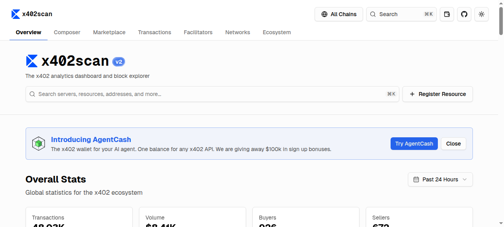

# Situation Report - 2026-04-03

## Highlights

**1. ZK on Bitcoin: A Complete Technical Map** — zkSecurity's "Proof is in the Pudding" session surveys every viable path to ZK verification on Bitcoin today: MPC-based verification (sidesteps Script entirely), BitVM's optimistic fraud proofs, Lamport signatures for simulated state, Taproot for complex-script privacy, simulated covenants without new opcodes, BitVM 3 using garbled circuits with cut-and-choose security, and witness encryption (BABE) at the frontier. Bitcoin's UTXO model and constrained Script make direct verification impossible — this is not one approach but a growing toolkit of creative workarounds, each trading trust assumptions, liveness (timelocks), and complexity. Essential reading for anyone building Bitcoin L2 or bridge protocols. [Link](https://blog.zksecurity.xyz/posts/pudding-9-zk-bitcoin/)

**2. Cloudflare: AI Crawlers Are Breaking CDN Cache** — 32% of Cloudflare's traffic is automated, with AI crawlers hitting >90% unique URLs (vs. humans revisiting popular pages). Wikipedia saw 50% multimedia bandwidth surge, SourceHut experienced instability, Fedora/ReadTheDocs suffered spikes. Standard LRU/prefetching fails against these patterns. Solutions: SIEVE and S3-FIFO eviction algorithms (ETH Zurich collaboration, SoCC 2025) that insulate human cache hit rates from AI interference, ML-based workload-aware caching, and a tiered architecture separating human edge caches from AI-specific deep cache with queue-based admission. First major CDN publicly documenting AI traffic's structural impact on shared infrastructure. [Link](https://blog.cloudflare.com/rethinking-cache-ai-humans/)

**3. Lattice-Based RBE Shrinks 60x — Post-Quantum Identity Encryption Becomes Practical** — Zhang, Ding, Malavolta, and Döttling construct a lattice-based Registration-Based Encryption scheme achieving 0.148 MB ciphertexts for 1000 users — 60x smaller than prior lattice RBE (9 MB). RBE eliminates IBE's key escrow problem without requiring PKI or pairings. This is the first post-quantum RBE approaching practical efficiency for real-world identity-based access control and encrypted messaging. [Link](https://eprint.iacr.org/2026/628)

**4. MQOM Security Proofs Repaired for Quantum Adversaries** — Kosuge and Xagawa identify a fundamental circularity in MQOM's GGM-tree security proof and propose two repaired variants: one EUF-CMA secure in the quantum random oracle model under partial-domain one-wayness, another secure under standard one-wayness in the ideal-cipher + ROM. Only minor salt-generation changes required. This shores up the formal foundations of a leading NIST PQC Round 2 MPC-in-the-Head signature candidate. [Link](https://eprint.iacr.org/2026/629)

**5. Sparse LWE Has a Sharp Security Phase Transition** — Chi, Cho, Kim, and Lee provide the first asymptotic hardness analysis of ternary sparse LWE. Two attack regimes: geometric (q > 3^k, solvable via lattice sieving in 2^{0.292k}) and statistical (q ≤ 3^k, greedy coordinate recovery in O(m·k·3^k)). The standard LWE small-to-large-secret reduction does not carry over. Critical for parameter selection in spLWE-based schemes that underpin FHE efficiency improvements. [Link](https://eprint.iacr.org/2026/630)

---

## Blogs & Research

### ZK Proofs / Bitcoin

**[Proof Is in the Pudding: ZK on Bitcoin](https://blog.zksecurity.xyz/posts/pudding-9-zk-bitcoin/)** — zkSecurity / Archetype, Apr 2
Comprehensive technical survey of ZK verification approaches on Bitcoin. Six concrete paths: MPC-based ZK (no Script dependency), BitVM optimistic verification (fraud proofs), Lamport signatures (stateless→stateful simulation), Taproot (complex scripts with privacy), simulated covenants, BitVM 3 (garbled circuits + hashlocks + cut-and-choose). Frontier: witness encryption via BABE. Each approach makes distinct tradeoffs in trust, liveness, and complexity. Bitcoin L2 and bridge protocols increasingly depend on ZK-adjacent cryptography without protocol changes.

### Infrastructure / Distributed Systems

**[Why We're Rethinking Cache for the AI Era](https://blog.cloudflare.com/rethinking-cache-ai-humans/)** — Cloudflare, Apr 2
AI crawlers generate >90% unique URLs, target crawler-specific content types, and produce high 404/redirect rates — all of which tank cache hit rates. Real-world impact: Wikipedia +50% multimedia bandwidth, SourceHut instability, Fedora/ReadTheDocs bandwidth spikes. Proposed solutions: SIEVE and S3-FIFO eviction (ETH Zurich/SoCC 2025) insulating human traffic from AI interference, ML-based workload-aware caching, tiered human-edge/AI-deep cache architecture with queue-based admission. Complements existing AI Index, AI Crawl Control, and Pay Per Crawl products.

### P2P Networking

**[Kiyeovo: P2P Messenger with Dual Network Modes](https://github.com/Realman78/Kiyeovo/)** — Open source, HN frontpage (278 pts)
Decentralized desktop messenger built on Electron + React + libp2p with two isolated network modes. Fast mode: clearnet TCP/IP, relay NAT traversal, WebRTC audio/video (coturn STUN/TURN). Anonymous mode: Tor onion services, `/onion3/` multiaddresses, localhost-only listening. DHT for peer discovery and offline message storage. scrypt key derivation for local identity protection. Self-hostable bootstrap/relay/TURN servers. Demonstrates that a single app can cleanly separate clearnet and Tor stacks via libp2p — a design pattern more P2P tools should adopt.

---

## Academic Papers

### Post-Quantum Cryptography

**[Towards Formal Security Proofs of MQOM](https://eprint.iacr.org/2026/629)** — Kosuge, Xagawa
Identifies circularity in MQOM's GGM-tree security proof (secret-key-rooted tree creates dependency between transcript randomization and key hiding). Two repairs: EUF-CMA in QROM under partial-domain OWP, and standard OWP in IC+ROM. Minor salt-generation changes only. First rigorous EUF-CMA proofs for MQOM under quantum adversaries. Validates a leading NIST PQC MPC-in-the-Head candidate.

**[Fast and Compact Lattice-Based Registration-Based Encryption](https://eprint.iacr.org/2026/628)** — Zhang, Ding, Malavolta, Döttling
Lattice-based RBE with 0.148 MB ciphertexts for 1000 users (60x reduction from 9 MB prior). Eliminates IBE key escrow without pairings. First post-quantum RBE approaching practical efficiency. Viable for identity-based access control and messaging systems.

**[Asymptotic Analysis of Ternary Sparse LWE](https://eprint.iacr.org/2026/630)** — Chi, Cho, Kim, Lee
Sharp security phase transition at q = 3^k. Geometric regime (q > 3^k): lattice sieving in 2^{0.292k}. Statistical regime (q ≤ 3^k): greedy recovery in O(m·k·3^k). Standard LWE reductions fail for spLWE. Critical for FHE parameter selection — naive choices may be insecure.

**[Isogeny-Based Deterministic Group Actions](https://eprint.iacr.org/2026/627)** — Wang, Lai, Lin, Zhao
Fastest isogeny-based non-interactive key exchange (OSIDH-LD) implementation with parallelization. Advances post-quantum key exchange from isogeny assumptions.

**[r-PKP Reformulation](https://eprint.iacr.org/2026/631)** — D'Alconzo, Gangemi, Romano, Romeo
Removes instance dependence from the relaxed Permuted Kernel Problem, simplifying PQ signature design.

### FHE

**[Concrete Estimation of FHE Correctness and IND-CPA-D Security](https://eprint.iacr.org/2026/610)** — Ballandras, Orfila, Tap
Importance-splitting framework verifying FHE noise models down to 2^{-128} probability. Validates standard Gaussian model (shown conservative) and refined Irwin-Hall distribution on TFHE bootstrapping. Bridges theoretical noise analysis and deployed parameter selection (e.g., Zama's Concrete compiler). Enables tighter — and thus more performant — parameters without sacrificing provable guarantees.

### Privacy / ZK Networking

**[Topology-Hiding Connectivity-Assurance for QKD Inter-Networking](https://arxiv.org/abs/2604.01876)** — Cozzolino, Krenn, Lorünser
ZK proof protocol for QKD networks: endpoints prove secure end-to-end connectivity through trusted-repeater chains without revealing internal topology. Extends graph-signature techniques to multi-graphs with concealed endpoints. Supports multi-path redundancy certification. Enables inter-provider QKD networking with infrastructure privacy.

### Distributed Systems

**[DarwinNet: Evolutionary Protocol Synthesis](https://arxiv.org/abs/2604.01236)** — Xu, Li
Three-tier bio-inspired architecture: L0 (immutable physical anchor), L1 (WASM execution cortex), L2 (LLM-powered "Darwin Cortex" for protocol synthesis). Intent-to-bytecode mechanism translates business objectives into executable protocol bytecode via evolutionary dual-loop. "Protocol Solidification Index" measures convergence toward native performance. Zero-trust sandboxing for runtime security.

---

## Dashboard Activity

### MPPScan (Machine Payments Protocol) — 7-Day Rolling

| Metric | Value | Δ vs Yesterday |
|---|---|---|
| Total Transactions | 32,476 | ~flat |
| Total Volume | $2,435 USDC | ↓ from $3,614 |
| Unique Agents | 733 | ↑ from 623 |
| Unique Servers | 402 | ~flat |

**Top services:**

| Service | Txns | Volume | Buyers |
|---|---|---|---|
| Apollo via Locus MPP | 6,189 | $45.10 | 11 |
| StableEnrich | 4,341 | $86.74 | 69 |
| StableStudio | 3,377 | $88.57 | 86 |
| Mobula API | 2,887 | $1.08 | 2 |
| Suno via Locus MPP | 1,878 | $29.99 | 12 |
| Exa | 734 | $3.78 | 98 |

Notable: **Volume dropped 33%** ($3,614 → $2,435) while transaction count held steady — average tx value is declining. Agent count rose (623 → 733), suggesting broader but lower-value adoption. 91 registered payment servers. Locus MPP remains dominant aggregator (4 of top 10).

---

### x402scan (x402 Ecosystem) — 24h

| Metric | Value | Δ vs Yesterday |
|---|---|---|
| Total Transactions (24h) | 48,030 | ↓ from 63,160 |
| Total Volume (24h) | $8,410 USDC | ↓ from $24,250 |
| Unique Buyers | 926 | ↓ from 1,380 |
| Unique Sellers | 672 | ~flat |

**Top sellers (24h):**

| Service | Txns | Volume | Buyers | Chain |
|---|---|---|---|---|
| ACP - Virtuals Protocol | 5,820 | $185.17 | 336 | Base |
| SniperX | 5,180 | $103.56 | 12 | Solana |
| BlockRun | 3,660 | $345.17 | 70 | Base |
| StableEnrich | 2,210 | $55.95 | 42 | Base/Solana |
| Dexter x402 | 825 | $42.55 | 98 | Solana |
| Nansen | 782 | $20.38 | 31 | Base/Solana |

**Facilitators:** Coinbase (33.7K requests, $1.1K, ~70% of traffic), Dexter (8.5K, $289), Virtuals Protocol (2.9K, $93).

Notable: **Significant pullback.** x402 24h txns dropped 24% (63K → 48K) and volume dropped 65% ($24.3K → $8.4K). BlockRun leads in dollar volume ($345) despite ranking third in transactions. Vishwa Network MCP (yesterday's #2 at 8,650 txns) dropped out of the top 10 entirely — likely a burst rather than sustained traffic. Coinbase share of facilitation remains ~70%.

---

## Industry News

### Hacker News
- **[LinkedIn Is Searching Your Browser Extensions](https://browsergate.eu/)** (1,653 pts) — Browser fingerprinting via extension enumeration; privacy surveillance
- **[P2P Messenger with Dual Tor/Fast Mode (Kiyeovo)](https://github.com/Realman78/Kiyeovo/)** (278 pts) — Discussed in Blogs above
- **[JSON Canvas Spec](https://jsoncanvas.org/spec/1.0/)** (277 pts) — Open spec for infinite canvas data from Obsidian; local-first interoperable format
- **[Foxing: eBPF-Powered Filesystem Replication](https://codeberg.org/aenertia/foxing)** (173 pts) — eBPF-based distributed filesystem replication engine
- **[Axios NPM Post Mortem](https://github.com/axios/axios/issues/10636)** (78 pts) — Continued coverage of supply chain compromise

### Lobsters
- **[jj v0.40.0 Released](https://github.com/jj-vcs/jj/releases/tag/v0.40.0)** — Major release of Jujutsu, Rust-based VCS
- **[Every Dependency Is a Supply Chain Attack Waiting to Happen](https://benhoyt.com/writings/dependencies/)** — Software supply chain trust models
- **[Rewrites.bio: 60x Speedup in Genomics QC](https://rewrites.bio/)** — Rust rewrite achieving 60x performance gain
- **[Validating Hare's Sort Module via Symbolic Execution](https://notes.8pit.net/notes/y7n8.html)** — Formal verification of correctness

---

## New Releases

- **jj (Jujutsu) v0.40.0** — Rust-based version control system, major release
- **Rust 1.94.1** — Point release (covered yesterday in TWiR 645)

---

## Cross-Cutting Themes

**ZK verification is diversifying beyond Ethereum.** The zkSecurity Bitcoin survey documents six distinct paths to ZK on Bitcoin without protocol changes — from MPC-based verification to BitVM 3's garbled circuits to witness encryption. Combined with yesterday's Gryphes modular SNARK framework for zkRollups and the ongoing sum-check prover optimizations, ZK is simultaneously deepening on Ethereum and expanding to Bitcoin. The toolkit is growing faster than any single chain's roadmap.

**Post-quantum standardization is entering the proof-repair phase.** Two MQOM papers in two days (yesterday's MPC-in-the-Head correlated GGM trees from Feneuil/Rivain and today's QROM security repair from Kosuge/Xagawa) show NIST PQC candidates undergoing intense formal scrutiny. The sparse LWE phase-transition result adds that even newer efficiency-oriented hardness assumptions have sharp security boundaries that naive parameter choices miss. PQ migration is not just "pick an algorithm" — it's an ongoing process of finding and fixing subtle proof gaps.

**Agentic commerce shows its first pullback.** Both dashboards declined: MPP volume dropped 33% while holding transaction count (lower-value txns), and x402 dropped 24% in txns and 65% in volume. Vishwa Network MCP (yesterday's #2 seller) disappeared from x402's top 10. This may be natural variance, a burst-traffic correction, or early signs of the "trough of disillusionment" in agent payment adoption. Worth watching over the next few days.

**AI traffic is a distributed systems problem now.** Cloudflare's data shows AI crawlers structurally differ from human traffic: >90% unique URLs, crawler-specific content targeting, high error rates. The CDN response — workload-aware eviction (SIEVE/S3-FIFO), tiered cache architecture, queue-based admission — is infrastructure-level distributed systems design, not just rate-limiting. Combined with Vitalik's local-first LLM advocacy (yesterday), the AI-vs-infrastructure tension is producing real architectural innovation at both the edge (CDN) and the endpoint (local inference).
